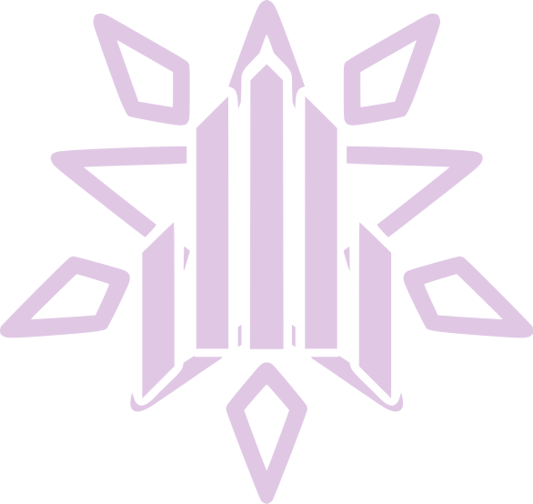

<div align="center">



<h1>SKY LAB Ar-Ge</h1>

<p>
  A modern, animated showcase for the R&amp;D teams of the Yıldız Technical
  University Computer Science Club — bringing every team's vision, projects,
  and recruitment process into a single interface.
</p>

[](https://arge.yildizskylab.com)
[](https://nextjs.org)
[](https://react.dev)
[](https://tailwindcss.com)
[](https://www.framer.com/motion/)

> Nine teams, one ecosystem. From AI to cybersecurity, game development to embedded systems — every team's domain, leadership, tech stack, and active projects on a single page.

</div>

---

## Features

### Landing Experience
- **Animated Hero** - Manifested with Framer Motion, magnetic buttons, and a parallax-aware logo that surfaces all nine teams.
- **Team Sections** - Scroll-pinned panels where each team's long description, lead(s), stack, and featured works live in a sticky frame.
- **Onboarding Flow** - A four-step, scroll-progress-driven visualisation of the candidate → active member journey.
- **Hash Navigation** - Deep-link to any team with `#team-id`, complete with smooth scroll and URL synchronisation.

### Stand View (`/stant`)
- **Kiosk Mode** - A keyboard-navigable showcase (`←/→`, `1-9`, `P`) optimised for the large displays used at SKY LAB stands.
- **Auto Loop** - 8-second interval rotation between teams with a pause/play control.
- **Dynamic QR** - For recruiting teams, a client-side QR is generated from `applyUrl` so visitors can apply straight from their phone.
- **Small-Screen Guard** - Devices under 1024px see a friendly notice that redirects them back to the landing page.

### Design &amp; Accessibility
- **Spotlight + Aurora Background** - Pointer-reactive gradient and grain effects that automatically disable under `prefers-reduced-motion`.
- **Tonal Color System** - Every team has its own `ring/chip/glow/soft` palette centralised in `data/teams/visuals.js`.
- **SEO &amp; OG** - Metadata, sitemap, robots.txt, and Open Graph tags managed through the Next.js metadata API.

---

## Tech Stack

| Layer | Technology |
| --- | --- |
| Framework | Next.js 16 (App Router) |
| UI Library | React 19 |
| Styling | Tailwind CSS v4 (`@tailwindcss/postcss`) |
| Animation | Framer Motion 12 |
| Icons | lucide-react |
| Fonts | Space Grotesk + JetBrains Mono (`next/font/google`) |
| QR Generation | `qrcode-generator` (CDN, client-side) |
| Linting | ESLint 9 + `eslint-config-next` |
| Runtime | Node.js 18.18+ |

---

## Pages & Routes

### Public

| Route | Description |
| --- | --- |
| `/` | Landing page — Hero, team showcase (scroll-pinned tabs), onboarding flow, and footer. |
| `/stant` | Kiosk view for event stands; keyboard-controlled team showcase with QR-driven applications. |
| `/sitemap.xml` | Auto-generated sitemap (Next.js `sitemap.js`). |
| `/robots.txt` | Robots rules open to all crawlers (`robots.js`). |

> This project has no admin panel or protected routes — content is rendered entirely from static data in `src/data/teams`.

---

## Getting Started

### Prerequisites
- **Node.js** `18.18` or later (Next.js 16 recommends `20.x` LTS).
- **npm** `10+` (alternatives such as `pnpm` / `yarn` / `bun` also work; the repo is locked via `package-lock.json`).
- A modern browser (recent Chrome / Edge / Safari / Firefox).

### Installation

```bash
git clone https://github.com/fatiihnaz/arge.git
cd arge
npm install
```

### Environment Variables

The project does **not** require a `.env` file to run. The variable below is purely an optional override for SEO metadata and the sitemap:

| Variable | Required | Default | Description |
| --- | --- | --- | --- |
| `NEXT_PUBLIC_SITE_URL` | No | `https://arge.yildizskylab.com` | Canonical site URL used in `metadataBase`, `sitemap.xml`, and `robots.txt`. |

To override locally, create a `.env.local` file in the project root with a single line:

```bash
NEXT_PUBLIC_SITE_URL=http://localhost:3000
```

### Running the App

```bash
# Development server (http://localhost:3000)
npm run dev

# Production build
npm run build

# Production server
npm run start

# Lint
npm run lint
```

---

## Contributing

For the full contribution process — project layout, architectural decisions, commit conventions, and PR workflow — please see [CONTRIBUTING.md](CONTRIBUTING.md).

## License

This project is developed and maintained by **SKY LAB - Yıldız Technical University Computer Science Club**.
